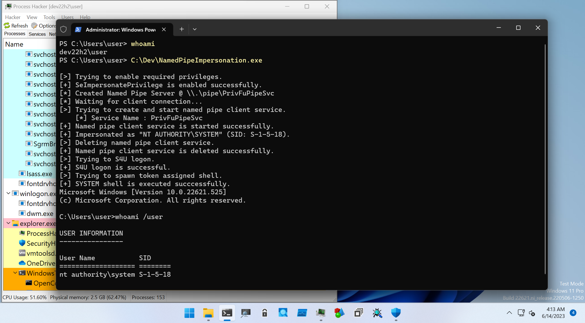

# Arts Of GetSystem

This directory is for PoCs to help learning how to get SYSTEM privilege.
Currently, token stealing PoC is the only uploaded code, but more PoCs will be uploaded later.

## Named Pipe Impersonation

Named Pipe impersonation technique is one of the most popular technique to get SYSTEM privilege.
This methods is implemented in the PoC named [NamedPipeImpersonation](./NamedPipeImpersonation):

```
PS C:\Dev> .\NamedPipeImpersonation.exe -h

NamedPipeImpersonation - PoC to get SYSTEM privileges with named pipe method.

Usage: NamedPipeImpersonation.exe [Options]

        -h, --help    : Displays this help message.
        -t, --timeout : Specifies timeout in milliseconds. Default is 3,000 ms.

PS C:\Dev>
```




## Token Stealing

If you can duplicate token from SYSTEM privileged process and have sufficient privileges, you can create SYSTEM privileged process.
There are several patterns as folllows:

1. If you have `SeAssignPrimaryTokenPrivilege` and `SeIncreaseQuotaPrivilege`, you can directry assign duplicated primary token to new process by [`CreateProcessAsUser` API](https://learn.microsoft.com/en-us/windows/win32/api/processthreadsapi/nf-processthreadsapi-createprocessasusera).

2. If you have `SeImpersonatePrivilege`, you can get SYSTEM privilege as following steps:

    1. Duplicate impersonation token from a SYSTEM privileged process which has `SeAssignPrimaryTokenPrivilege` and `SeIncreaseQuotaPrivilege`.

    2. Using `SeImpersonatePrivilege`, assign impersonation token to execution thread by [`ImpersonateLoggedOnUser` API](https://learn.microsoft.com/en-us/windows/win32/api/securitybaseapi/nf-securitybaseapi-impersonateloggedonuser) or [`SetThreadToken` API](https://learn.microsoft.com/en-us/windows/win32/api/processthreadsapi/nf-processthreadsapi-setthreadtoken).

    3. Using `SeAssignPrimaryTokenPrivilege` and `SeIncreaseQuotaPrivilege`, create a new token assigned process as explained above.

3. If you have `SeImpersonatePrivilege`, and `Secondary Logon` service is available, you can create a new token assigned process by [`CreateProcessWithToken` API](https://learn.microsoft.com/en-us/windows/win32/api/winbase/nf-winbase-createprocesswithtokenw).

These methods are implemented in the PoC named [TokenStealing](./TokenStealing):

```
PS C:\Dev> .\TokenStealing.exe -h

TokenStealing - PoC to get SYSTEM privileges with token stealing method.

Usage: TokenStealing.exe [Options]

        -h, --help      : Displays this help message.
        -f, --full      : Flag to enable all token privileges.
        -s, --secondary : Flag to use Secondary Logon Service.

PS C:\Dev>
```


