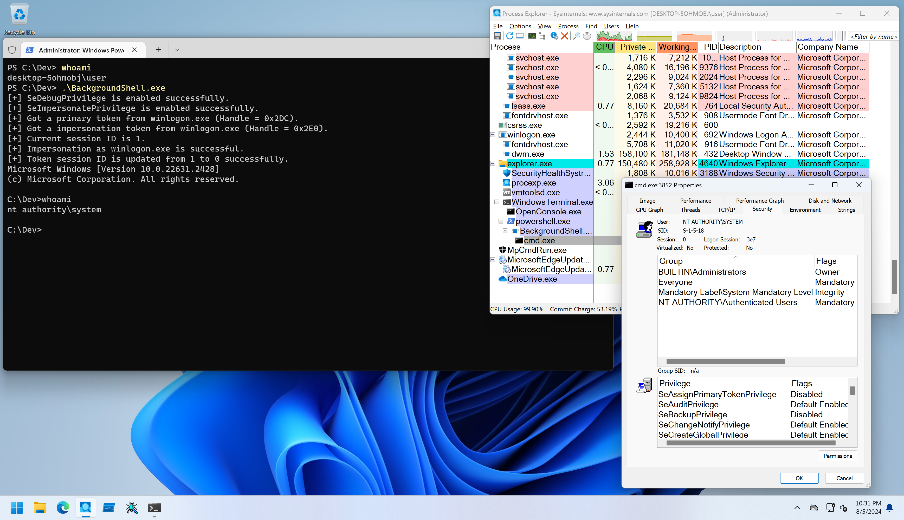
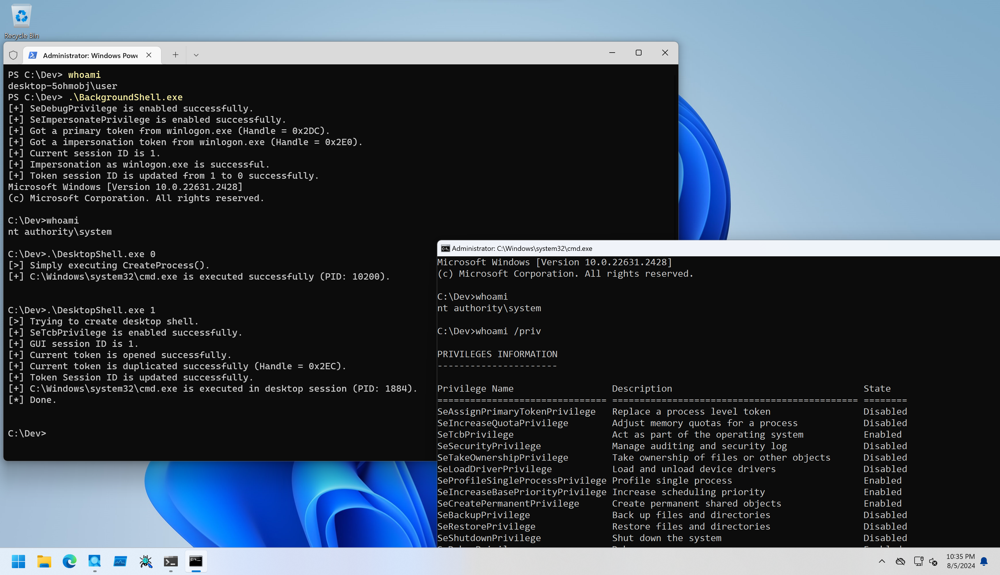
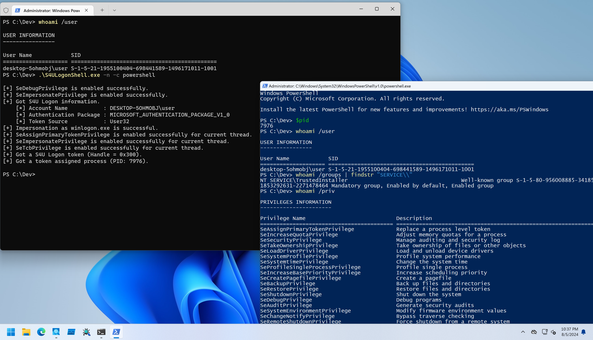
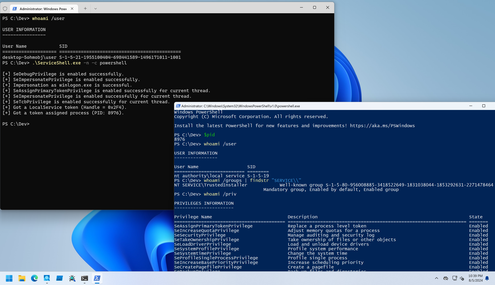
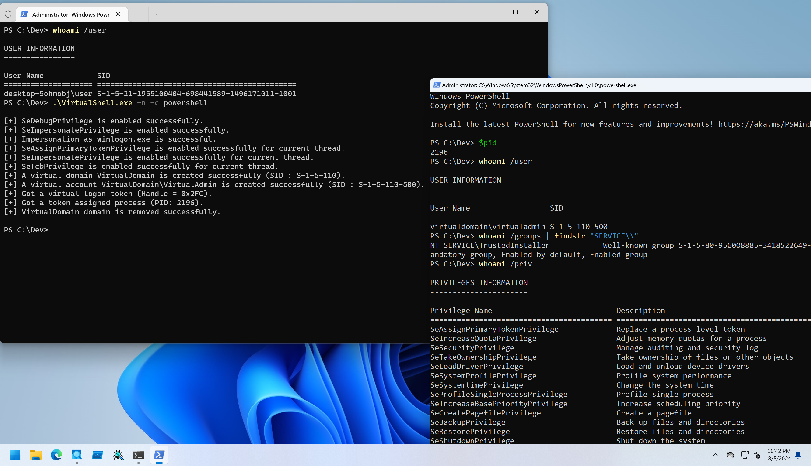

# PowerOfTcb

This directory covers how to use SeTcbPrivilege for educational purpose.
SeTcbPrivilege is a multi puropse privilege.
A user has SeTcbPrivilege is able to perform various token manipulation.
For example, following token factors class can be manipulated with SeTcbPrivilege (but most of them cannot be manipulated for assigned primary token):

* Session ID
* Origin
* Mandatory Policy
* Integrity Level (downgrade operation does not require SeTcbPrivilege)

More information is available from [SystemInformer's code](https://github.com/winsiderss/systeminformer/blob/master/phnt/include/ntseapi.h).
Additionally, SeTcbPrivilege allows to create special logon token and new SID maping with LSA family APIs.
To use these token, `SeAssignPrimaryTokenPrivilege` or `SeImpersonateToken` are required.
But Secondary Logon service overrides some elements in new process token with caller's primary token's ones (for example, session ID), so `SeAssignPrimaryTokenPrivilege` and `CreateProcessAsUser` API are preferred to create a token specified process.

To demonstrate these things for education, I wrote some tools.

## Create GUI Session Proccess

In the case of there are vulnerabilities such as DLL hijacking or SYSTEM privileged service configuration modification, loaded PE files are executed from background session.
This tool to demonstrate how to get GUI session process from background process.
To test session ID manipulation, I wrote executable format tool named as [`DesktopShell`](./DesktopShell/).
But background session process is hard to debug, so I wrote a tool named as [`BackgroundShell`](./BackgroundShell/) to create session `0` shell with `SeTcbPrivilege` and `SeAssignPrimaryTokenPrivilege`.

```
PS C:\Dev> whoami /user

USER INFORMATION
----------------

User Name            SID
==================== =============================================
desktop-5ohmobj\user S-1-5-21-1955100404-698441589-1496171011-1001
PS C:\Dev> whoami /groups | findstr /i level
Mandatory Label\High Mandatory Level                          Label            S-1-16-12288

PS C:\Dev> .\BackgroundShell.exe
[+] SeDebugPrivilege is enabled successfully.
[+] SeImpersonatePrivilege is enabled successfully.
[+] Got a primary token from winlogon.exe (Handle = 0x2D4).
[+] Got a impersonation token from winlogon.exe (Handle = 0x2DC).
[+] Current session ID is 1.
[+] Impersonation as winlogon.exe is successful.
[+] Token session ID is updated from 1 to 0 successfully.
Microsoft Windows [Version 10.0.22631.2428]
(c) Microsoft Corporation. All rights reserved.

C:\Dev>whoami /user

USER INFORMATION
----------------

User Name           SID
=================== ========
nt authority\system S-1-5-18

C:\Dev>whoami /priv

PRIVILEGES INFORMATION
----------------------

Privilege Name                  Description                                   State
=============================== ============================================= ========
SeAssignPrimaryTokenPrivilege   Replace a process level token                 Disabled
SeIncreaseQuotaPrivilege        Adjust memory quotas for a process            Disabled
SeTcbPrivilege                  Act as part of the operating system           Enabled
SeSecurityPrivilege             Manage auditing and security log              Disabled
SeTakeOwnershipPrivilege        Take ownership of files or other objects      Disabled
SeLoadDriverPrivilege           Load and unload device drivers                Disabled
SeProfileSingleProcessPrivilege Profile single process                        Enabled
SeIncreaseBasePriorityPrivilege Increase scheduling priority                  Enabled
SeCreatePermanentPrivilege      Create permanent shared objects               Enabled
SeBackupPrivilege               Back up files and directories                 Disabled
SeRestorePrivilege              Restore files and directories                 Disabled
SeShutdownPrivilege             Shut down the system                          Disabled
SeDebugPrivilege                Debug programs                                Enabled
SeAuditPrivilege                Generate security audits                      Enabled
SeSystemEnvironmentPrivilege    Modify firmware environment values            Disabled
SeChangeNotifyPrivilege         Bypass traverse checking                      Enabled
SeUndockPrivilege               Remove computer from docking station          Disabled
SeManageVolumePrivilege         Perform volume maintenance tasks              Disabled
SeImpersonatePrivilege          Impersonate a client after authentication     Enabled
SeCreateGlobalPrivilege         Create global objects                         Enabled
SeTrustedCredManAccessPrivilege Access Credential Manager as a trusted caller Disabled
```



`DesktopShell` implements 2 methods to create `cmd.exe` process.

```
C:\Dev>.\DesktopShell.exe
Usage: DesktopShell.exe <0 or 1>
```

If set `0`, it will simply execute `cmd.exe` with `CreateProcess` API, and a GUI `cmd.exe` will not be appeared from session `0` process as follows:

```
C:\Dev>DesktopShell.exe 0
[>] Simply executing CreateProcess().
[+] C:\Windows\system32\cmd.exe is executed successfully (PID: 9496).
```


When set `1`, it will try to find GUI session ID, enable `SeTcbPrivilege` and `SeAssignPrimaryTokenPrivilege` duplicate process token, set GUI session ID to the duplicated token and create `cmd.exe` process with the token:

```
C:\Dev>DesktopShell.exe 1
[>] Trying to create desktop shell.
[+] SeTcbPrivilege is enabled successfully.
[+] GUI session ID is 1.
[+] Current token is opened successfully.
[+] Current token is duplicated successfully (Handle = 0x2F0).
[+] Token Session ID is updated successfully.
[+] C:\Windows\system32\cmd.exe is executed in desktop session (PID: 10684).
[*] Done.
```



If you want to check DLL version, use [`DesktopShellLib`](./DesktopShellLib/).
It exports `GetShell` function for simply executing `cmd.exe` by `CreateProcess`, and `GetDesktopShell` function for executing `cmd.exe` in GUI session.


## S4U Logon

To demonstrate S4U logon, I wrote a tool named as [`S4ULogonShell`](./S4ULogonShell/).
This tool try to create S4U logon token with `NT SERVICE\TrustedInstaller` group:

```
PS C:\Dev> .\S4ULogonShell.exe -h

S4ULogonShell - PoC to create S4U Logon process.

Usage: S4ULogonShell.exe [Options]

        -h, --help        : Displays this help message.
        -c, --command     : Specifies command to execute. Default is cmd.exe.
        -i, --interactive : Flag to execute process with same console.
        -n, --new-console : Flag to execute process with new console.
```

To get interactive shell, set `-i` flag as follows:

```
PS C:\Dev> .\S4ULogonShell.exe -i -c powershell

[+] SeDebugPrivilege is enabled successfully.
[+] SeImpersonatePrivilege is enabled successfully.
[+] Got S4U Logon information.
    [*] Account Name           : DESKTOP-5OHMOBJ\user
    [*] Authentication Package : MICROSOFT_AUTHENTICATION_PACKAGE_V1_0
    [*] Token Source           : User32
[+] Impersonation as winlogon.exe is successful.
[+] SeAssignPrimaryTokenPrivilege is enabled successfully for current thread.
[+] SeImpersonatePrivilege is enabled successfully for current thread.
[+] SeTcbPrivilege is enabled successfully for current thread.
[+] Got a S4U Logon token (Handle = 0x2FC).
[+] Got a token assigned process (PID: 2944).
Windows PowerShell
Copyright (C) Microsoft Corporation. All rights reserved.

Install the latest PowerShell for new features and improvements! https://aka.ms/PSWindows

PS C:\Dev> whoami /user

USER INFORMATION
----------------

User Name            SID
==================== =============================================
desktop-5ohmobj\user S-1-5-21-1955100404-698441589-1496171011-1001
PS C:\Dev> whoami /priv

PRIVILEGES INFORMATION
----------------------

Privilege Name                            Description                                                        State
========================================= ================================================================== =======
SeAssignPrimaryTokenPrivilege             Replace a process level token                                      Enabled
SeIncreaseQuotaPrivilege                  Adjust memory quotas for a process                                 Enabled
SeSecurityPrivilege                       Manage auditing and security log                                   Enabled
SeTakeOwnershipPrivilege                  Take ownership of files or other objects                           Enabled
SeLoadDriverPrivilege                     Load and unload device drivers                                     Enabled
SeSystemProfilePrivilege                  Profile system performance                                         Enabled
SeSystemtimePrivilege                     Change the system time                                             Enabled
SeProfileSingleProcessPrivilege           Profile single process                                             Enabled
SeIncreaseBasePriorityPrivilege           Increase scheduling priority                                       Enabled
SeCreatePagefilePrivilege                 Create a pagefile                                                  Enabled
SeBackupPrivilege                         Back up files and directories                                      Enabled
SeRestorePrivilege                        Restore files and directories                                      Enabled
SeShutdownPrivilege                       Shut down the system                                               Enabled
SeDebugPrivilege                          Debug programs                                                     Enabled
SeAuditPrivilege                          Generate security audits                                           Enabled
SeSystemEnvironmentPrivilege              Modify firmware environment values                                 Enabled
SeChangeNotifyPrivilege                   Bypass traverse checking                                           Enabled
SeRemoteShutdownPrivilege                 Force shutdown from a remote system                                Enabled
SeUndockPrivilege                         Remove computer from docking station                               Enabled
SeManageVolumePrivilege                   Perform volume maintenance tasks                                   Enabled
SeImpersonatePrivilege                    Impersonate a client after authentication                          Enabled
SeCreateGlobalPrivilege                   Create global objects                                              Enabled
SeIncreaseWorkingSetPrivilege             Increase a process working set                                     Enabled
SeTimeZonePrivilege                       Change the time zone                                               Enabled
SeCreateSymbolicLinkPrivilege             Create symbolic links                                              Enabled
SeDelegateSessionUserImpersonatePrivilege Obtain an impersonation token for another user in the same session Enabled
PS C:\Dev> whoami /groups

GROUP INFORMATION
-----------------

Group Name                                                    Type             SID                                                            Attributes
============================================================= ================ ============================================================== ===============================================================
Everyone                                                      Well-known group S-1-1-0                                                        Mandatory group, Enabled by default, Enabled group
NT AUTHORITY\Local account and member of Administrators group Well-known group S-1-5-114                                                      Mandatory group, Enabled by default, Enabled group
BUILTIN\Administrators                                        Alias            S-1-5-32-544                                                   Mandatory group, Enabled by default, Enabled group, Group owner
BUILTIN\Users                                                 Alias            S-1-5-32-545                                                   Mandatory group, Enabled by default, Enabled group
NT AUTHORITY\NETWORK                                          Well-known group S-1-5-2                                                        Mandatory group, Enabled by default, Enabled group
NT AUTHORITY\Authenticated Users                              Well-known group S-1-5-11                                                       Mandatory group, Enabled by default, Enabled group
NT AUTHORITY\This Organization                                Well-known group S-1-5-15                                                       Mandatory group, Enabled by default, Enabled group
NT AUTHORITY\Local account                                    Well-known group S-1-5-113                                                      Mandatory group, Enabled by default, Enabled group
Mandatory Label\System Mandatory Level                        Label            S-1-16-16384
NT AUTHORITY\LOCAL SERVICE                                    Well-known group S-1-5-19                                                       Mandatory group, Enabled by default, Enabled group
NT SERVICE\TrustedInstaller                                   Well-known group S-1-5-80-956008885-3418522649-1831038044-1853292631-2271478464 Mandatory group, Enabled by default, Enabled group
NT AUTHORITY\NTLM Authentication                              Well-known group S-1-5-64-10                                                    Mandatory group, Enabled by default, Enabled group
```

When set `-n` flag, it will try create new console:




## Process Creation as a Service Account

To demonstrate service account logon, I wrote a tool named as [`ServiceShell`](./ServiceShell/).
This tool try to create `LocalService` account token with `NT SERVICE\TrustedInstaller` group.
Usage is same as `S4ULogonShell`:

```
PS C:\Dev> .\ServiceShell.exe -h

ServiceShell - PoC to create Service Logon process.

Usage: ServiceShell.exe [Options]

        -h, --help        : Displays this help message.
        -c, --command     : Specifies command to execute. Default is cmd.exe.
        -i, --interactive : Flag to execute process with same console.
        -n, --new-console : Flag to execute process with new console.
```




## Process Creation as a Virtual Account

To demonstrate virtual account logon, I wrote a tool named as [`VirtualShell`](./VirtualShell/).
This tool try to create a new virtual account named as `VirtualDomain\VirtualAdmin` (SIDs are `S-1-5-110` and `S-1-5-110-500`) and new process as the account with `NT SERVICE\TrustedInstaller` group.
C language version can be available from [Grzegorz Tworek's PSBits repository](https://github.com/gtworek/PSBits/tree/master/VirtualAccounts).
Usage is same as `S4ULogonShell`:

```
PS C:\Dev> .\VirtualShell.exe -h

VirtualShell - PoC to create virtual account process.

Usage: VirtualShell.exe [Options]

        -h, --help        : Displays this help message.
        -c, --command     : Specifies command to execute. Default is cmd.exe.
        -i, --interactive : Flag to execute process with same console.
        -n, --new-console : Flag to execute process with new console.
```


